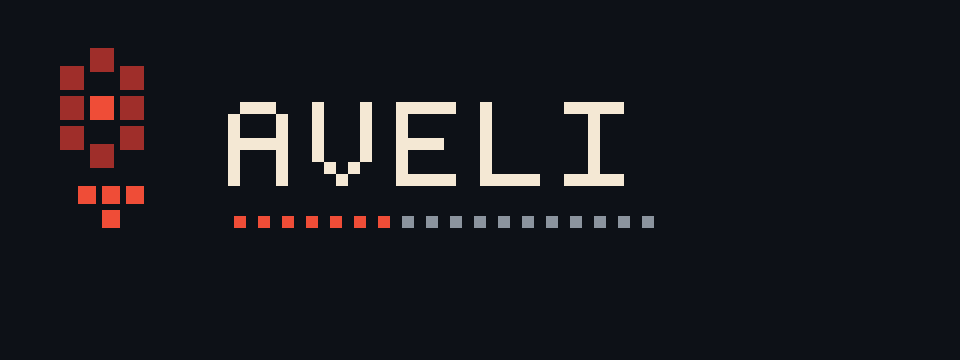
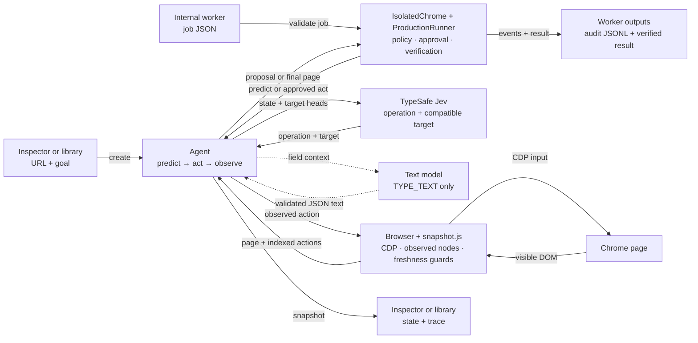

## How Aveli works

Each observation produces an indexed table of visible controls:

```text
[1] textbox   Search             · empty
[2] button    Run search         · visible
[3] checkbox  Include archived   · unchecked
[4] link      Result title       · visible
```

Aveli supports `CLICK`, `TYPE_TEXT`, `SELECT`, `SCROLL_UP`, `SCROLL_DOWN`, `WAIT`, `DONE`, and `BLOCKED`. The model receives only targets that support the proposed operation. It never emits selectors, coordinates, JavaScript, or shell commands.



The detailed design explains node identity, freshness checks, text caching, waits, and execution boundaries in [docs/design.md](docs/design.md).

## Quick start

Requirements:

- Python 3.12 or newer
- [uv](https://docs.astral.sh/uv/)
- Chrome with remote debugging enabled for [Browser Harness](https://github.com/browser-use/browser-harness)
- TypeSafe and text-model API keys

```bash
uv sync
cp .env.example .env
# Add TYPESAFE_API_KEY and TEXT_MODEL_API_KEY to .env.
uv run aveli
```

Open `http://127.0.0.1:8766`. Select **Start demo**, then select **Run automatically**. If Chrome does not connect, run `uv run browser-harness --doctor`.

See [configuration and development](docs/development.md) for provider settings, browser checks, recording commands, and the experimental Moli probe.

## Use the library

```python
from aveli import Agent

with Agent(
    "https://en.wikipedia.org/wiki/Main_Page",
    "Find and open the article about Gödel's incompleteness theorems.",
) as agent:
    for state in agent.run():
        print(state["elapsed_ms"], state["status"])
```

Run the example with your environment file:

```bash
uv run --env-file .env python examples/run.py \
  --url https://en.wikipedia.org/wiki/Main_Page \
  --goal 'Find and open the Wikipedia article about Gödel’s incompleteness theorems.'
```

Each yielded value is a snapshot of the agent state. Your application must verify the final page independently. `DONE` is a model choice, not proof of success.

## Safety boundaries

- One TypeSafe request carries the operation and compatible target heads.
- Every executable target comes from the current DOM snapshot.
- The browser checks freshness, visibility, geometry, and click occlusion before input.
- Text-model output must be a bounded JSON object.
- Aveli never retries a browser mutation.

The DOM reader supports common HTML and ARIA controls. It does not yet support shadow roots, frames, canvas, uploads, pop-up tabs, nested scrolling, or arbitrary keyboard widgets.

The inspector is not a production service. Bounded internal jobs use a separate fail-closed worker with host and action policy, isolated Chrome, audit events, approval hooks, and independent verification. See the [internal production runbook](docs/internal-production.md).

## Project map

| Area | Source |
| --- | --- |
| Agent loop | [`aveli/agent.py`](aveli/agent.py) |
| Browser snapshot and execution | [`aveli/browser.py`](aveli/browser.py), [`aveli/snapshot.js`](aveli/snapshot.js) |
| Model boundary | [`aveli/model.py`](aveli/model.py) |
| Production worker | [`aveli/runner.py`](aveli/runner.py), [`aveli/worker.py`](aveli/worker.py) |

## Development

```bash
uv run ruff check .
uv run pytest
node --check aveli/static/app.js
node --check aveli/snapshot.js
uv build
```

Tests do not call paid APIs. Live examples and recording scripts do. Read [docs/development.md](docs/development.md) before running browser checks or recordings.

Contributions are welcome. Read [CONTRIBUTING.md](CONTRIBUTING.md) before opening a pull request.

## Documentation

[Documentation index](docs/README.md) · [Design](docs/design.md) · [Configuration and development](docs/development.md) · [Internal production](docs/internal-production.md)

Built with [Browser Use](https://github.com/browser-use/browser-use), [Browser Harness](https://github.com/browser-use/browser-harness), and [TypeSafe speculative fan-out](https://docs.typesafe.ai/patterns/fan-out).
