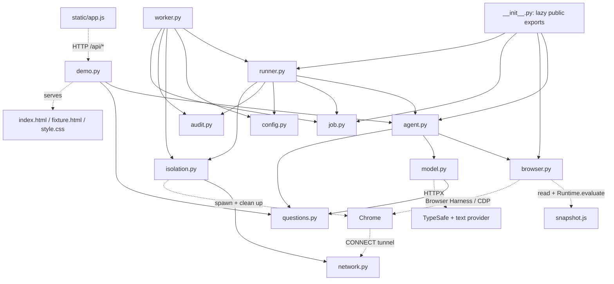
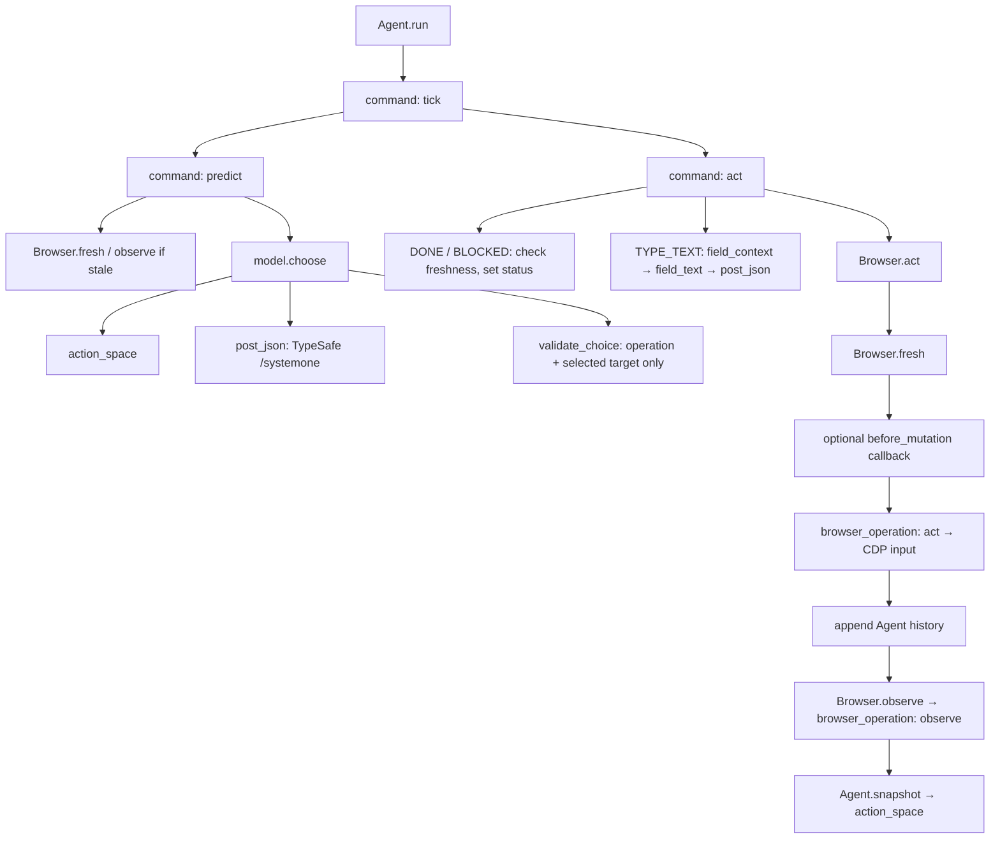
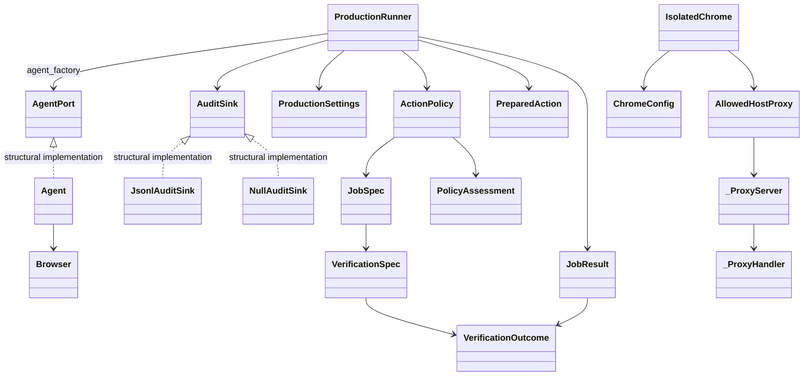

# Aveli code graph

## Overview

The repository has one shared browser-agent loop and two execution boundaries:

- `aveli` runs a loopback HTTP inspector with a shared Agent and a browser tab in the existing Chrome profile.
- `aveli-internal-worker` runs one bounded job per process, with typed policy, isolated Chrome, an allowlist proxy, audit events, and outcome verification.

Both paths use `Agent` to observe a page, ask TypeSafe for an operation and target, optionally generate text, and execute an observed browser action. Policy does not contain a site-specific action plan. Examples, fixtures, and video renderers are separate consumers of that loop.

This report describes the **current working tree**, including modified and untracked production-worker code. It is not a description of HEAD alone. No application files were changed by this analysis.

## Evidence and graph coverage

CodeGraph 1.5.0 indexed a temporary source copy. The original repository had no index. Python AST analysis independently checked imports, declarations, inheritance, and file-level cycles. Source reading supplied HTTP, DOM, callback, subprocess, resource-loading, and lazy-import relationships that the static graph cannot reliably resolve.

| Measurement | Result |
|---|---:|
| Source/configuration files inventoried | 47 |
| Python + standalone JavaScript lines | 4,865 |
| Files processed by CodeGraph | 42 |
| Graph nodes / edges | 657 / 1,483 |
| Class / function / method nodes | 41 / 163 / 103 |
| Raw call / instantiation / import edges | 557 / 104 / 145 |
| Other edges | 616 containment, 60 references, 1 inheritance |
| Python definitions independently located | 300, all present in CodeGraph |
| Distinct internal Python file-import edges | 56 |
| Python file-import cycles | None detected, including lazy imports |
| Unresolved CodeGraph references | 1,652 |
| Locked package entries, including this project and development tools | 23 |

The scope includes 29 other project files: documentation, evidence, templates, release gates, lockfile, and repository metadata. Two `.veyro` session files were excluded because they are local execution records, not application code. Ignored credentials, virtual environments, build output, and private run artifacts were not analyzed. These report artifacts are excluded from their own source counts.

### Detailed artifacts

- [Source/import inventory](codegraph/inventory.md): every analyzed source file, Python definition, inheritance declaration, direct import, and importer.
- [Complete Python import diagram](codegraph/imports.mmd): consumer → dependency, including tests and scripts.
- [Raw callable relationships](codegraph/calls.md): CodeGraph call, construction, and inheritance targets grouped by symbol.
- [Machine-readable graph](codegraph/graph.json): all nodes, edges, unresolved references, AST imports/declarations, source SHA-256 values, and locked package metadata.
- [Scope manifest](codegraph/scope.json): the original file set and exclusions.
- [Exporter](codegraph/export_graph.py): repeatable snapshot preparation and graph export.
- [Verification record](codegraph/verification.md): commands run and their results.

These are complementary views. Raw graph edges are hypotheses, not proof that a runtime call reaches that target. For example, CodeGraph maps `worker.execute`'s injected `runner_factory(...).run(job)` to `Agent.run`; the default target is actually `ProductionRunner.run`. It also links that factory call to the smoke script's test factory. The verified paths below correct those ambiguities.

CodeGraph processes the CI YAML without creating a file node, hence 42 indexed files but 41 file nodes. It does not index the two HTML files, CSS, Dockerfile, or `pyproject.toml`. It creates a file node for `snapshot.js` but misses the IIFE's nested helpers. Those relationships are documented below rather than silently counted as resolved.

## Module dependencies

Solid arrows below are Python imports. Dashed arrows are source-verified runtime links, not imports. `__init__.py` exposes `Agent`, `Browser`, `JobSpec`, and `ProductionRunner` through lazy `__getattr__` imports.



| File in `aveli/` | Responsibility | Direct internal imports |
|---|---|---|
| `__init__.py` | Lazy public API, preserves production initialization order | agent, browser, job, runner |
| `agent.py` | Decision lifecycle, helper cache, history, action/decision budgets | browser, model, questions |
| `browser.py` | Tab/session ownership, observation, freshness, execution | None; loads `snapshot.js` as a resource |
| `model.py` | Indexed action space, speculative target heads, HTTP calls, response validation | questions |
| `questions.py` | `NEXT_ACTION`, `TARGET`, `TEXT_VALUE`, `MAX_STEPS` | None |
| `demo.py` | Local HTTP server, token/host/origin checks, serialized commands | agent, questions |
| `job.py` | Immutable jobs, action policy, approval commitments, verification, results | None |
| `config.py` | Parse and validate production provider settings | None |
| `audit.py` | Redacted JSONL events and sink interface | None |
| `runner.py` | Policy → approval → execution → verification orchestration | agent, audit, config, isolation, job |
| `worker.py` | Stdin/stdout CLI, signal deadlines, one-job resource scope | audit, config, isolation, job, runner |
| `isolation.py` | Fresh Chrome/profile/harness namespace and cleanup | network |
| `network.py` | Exact-host HTTPS CONNECT proxy | None |

The most imported files are `isolation.py` with 7 direct importer files, `browser.py` and `job.py` with 6 each, and the package facade with 5. These counts include tests and scripts. They measure structural dependencies, not runtime frequency. Importing the package facade does not eagerly load every exported type.

## Entry points and dependents

| Entry point | Trigger / caller | Downstream path |
|---|---|---|
| `demo.main`, `demo.py:131` | `aveli` console script or module main guard | environment loader → HTTP server → Handler → Agent |
| `worker.main`, `worker.py:68` | `aveli-internal-worker`; Docker ENTRYPOINT | parse stdin → signal handlers → `execute` → result JSON / exit code |
| `worker.execute`, `worker.py:35` | worker CLI, worker tests, offline worker smoke | settings/job parsing → audit → isolation → runner |
| `ProductionRunner.run`, `runner.py:81` | worker's runner factory result, runner tests, library clients | policy/approval boundary around Agent commands |
| `Agent`, `agent.py:12` | demo, runner, examples, measurement/recording/smoke scripts | Browser setup and initial observation |
| `Agent.run`, `agent.py:199` | general/Flights examples, measurement/recording/live smoke scripts | repeated `command("tick")`; production runner does not use this method |
| `Browser`, `browser.py:21` | Agent, real guard checks, browser tests, library clients | Browser Harness daemon → owned CDP target/session |
| `app.js` top level | `/` loads `/app.js` | event listeners + initial GET `/api/state` |
| `fixture.html` inline script | demo fixture navigation | query parameter selects travel or research UI |
| `examples/flights.py:41` | script main guard | Agent loop → route/date/results verification → saved trace |
| `examples/run.py:7` onward | direct script execution | argparse → Agent context → Agent.run |
| CI workflow | push to main / pull request | offline checks, browser checks, container build/preflight |

`demo.Handler.do_GET` and `do_POST` are framework-dispatched methods. Their absence from a direct call chain does not make them unused. The same applies to context-manager methods, signal callbacks, thread targets, proxy request handlers, and DOM event listeners.

## Verified function call chains

### Browser-agent loop

Source anchors: `agent.py:13,66,183,199`; `model.py:48,81,152,166`; `browser.py:21,57,107,119,141`.



The diagram's execution branch is for browser mutations. WAIT sleeps and does not call the mutation hook. DONE/BLOCKED do not call `Browser.act`.

1. `Agent.__init__` creates `Browser`, takes an observation, and stores a single task, page, history, decisions, and timing state.
2. `predict` refreshes stale state, applies the model-call budget, and calls `choose`.
3. `action_space` gives each observed node one display index. It builds compatible CLICK/TYPE_TEXT/SELECT target maps and scroll/wait controls. Native select targets include an element and option index.
4. `choose` sends one TypeSafe request containing the operation question and all applicable target heads. It validates the operation and only that operation's selected target. The chosen target resolves back to a code-owned action ID.
5. `act` consumes the decision before helper generation or mutation. TYPE_TEXT builds `field_context`, then calls the text model. Cached text is reusable only when the full context is equal, including the page fingerprint and node identity.
6. `Browser.act` checks freshness, invokes the optional pre-mutation hook, and executes. The executor resolves current geometry and rejects covered or unavailable elements. Native SELECT changes the exact observed option and dispatches input/change events.
7. Agent appends execution history before the next observation. `observe` performs a bounded read-only settling wait after input, then reads structured state. Three consecutive unchanged non-WAIT actions stop the loop.
8. `tick` catches `StalePage`, clears the decision, and reobserves. It does not retry a completed browser mutation. Production's separate predict/act path does not use this catch; stale errors there become failed results.

`model.post_json` is the shared provider boundary. It uses a persistent HTTPX client, retries selected provider overload statuses, and does not retry browser input. Text-helper output must be a small JSON object with a nonempty `text` string.

### Observation and browser execution

`browser.py:13` reads `snapshot.js` into `READ_STATE`. `browser_operation("observe")` evaluates it, hashes URL/text/actions/scroll through `fingerprint`, and optionally captures a screenshot. Screenshots are for the inspector or recording, not model input.

The snapshot IIFE has these source-verified helper relationships:

| Helper / source line in `snapshot.js` | Dependencies and role |
|---|---|
| `identity`, 4 | WeakMap node IDs + Map of current node references |
| `safe`, 9 | Excludes password/file/hidden input types |
| `visible`, 10 | DOM visibility and ancestor hidden/inert checks |
| `name`, 12 | Recursive label/name resolution, with a visited set |
| `role`, 28 | Explicit ARIA roles and supported native control roles |
| `cache.pageKey`, 44 | `safe` + `identity`; document/viewport/form-value identity |
| `cache.guard`, 47 | `visible`, `identity`, `role`, `name`; target state and nearby text |
| IIFE body, 1 | Helpers → controls/actions + visible text + marker/page_key/guards; caps actions and appends scroll/wait |

`Browser.fresh(page, action)` uses action-specific page-key and target guards for CLICK/SELECT. Other checks use the full semantic marker. Geometry is re-read just before input, so movement alone need not trigger another model decision. Python's recorded SHA-256 fingerprint and JavaScript's freshness marker are different fields with different roles.

`Browser.call` and the nested `browser_operation.call` both delegate to `browser_harness.helpers.cdp`. There is no per-step CLI subprocess. `Browser.close` closes the owned target; production isolation owns the wider Chrome/daemon lifecycle.

### Inspector request path

Source anchors: `static/app.js:21,33,45,69,154`; `demo.py:32,44,81,103`.

```text
DOM event
  → perform(callback)                     sets busy state; handles errors
  → call(reset | predict | act | tick)    POST /api/{name}, token header
  → Handler.do_POST                      host/origin/token + nonblocking lock
  → demo.command
      reset → close_browser → Agent(...)
      other → Agent.command(name, body)
  → response_state → Agent.snapshot
  → JSON → app.js render → controls
```

Automatic mode repeats `tick`, or `predict` then a paced `act`. Stop clears the frontend loop flag; it does not cancel the current HTTP request. On error, `perform` tries GET `/api/state` to show the actual server state. Downloads serialize the current trace locally, omitting screenshot data.

GET serves `/`, `/app.js`, `/style.css`, `/fixture.html`, `/demo.mp4`, and `/api/state`. `index.html` loads an external Inter stylesheet from `rsms.me`; UI fonts therefore have a browser-side network dependency separate from model traffic. The demo is loopback-only and has one global Agent protected by a lock, not per-user sessions.

### Internal worker path

Source anchors: `worker.py:35,68`; `runner.py:53,61,73,81,173`; `job.py:100,218,277`.

```mermaid
sequenceDiagram
    participant CLI as worker.main
    participant W as worker.execute
    participant I as IsolatedChrome
    participant R as ProductionRunner
    participant A as Agent / Browser
    participant P as ActionPolicy
    participant V as VerificationSpec
    CLI->>W: decoded job + signal deadline
    W->>W: validate settings, JobSpec, ChromeConfig; create audit sink
    W->>I: enter per-job Chrome + allowed-host proxy
    W->>R: run(job)
    R->>I: require exact active isolation host set
    R->>A: create Agent, take initial snapshot
    loop bounded decision cycle
        R->>A: command(predict), proposed_action()
        R->>P: assess page URL and observed action
        Note over R,P: Freeze PreparedAction; request approval if required
        R->>A: compare proposal; command(act)
        A->>R: pre-mutation deadline check + audit callback
        A-->>R: executed history + post-action page
        R->>P: check resulting page host
    end
    Note over R,V: DONE takes terminal act branch, then verifier
    R->>V: verify(state.page)
    V-->>R: VerificationOutcome
    R-->>W: JobResult; close Agent in finally
    W->>I: exit and clean up
    W-->>CLI: result JSON, status-based exit code
```

The worker handles one stdin JSON job, not an HTTP request or queue message. Input is bounded at 64 KiB. Verified results exit 0, input/configuration failures exit 2, and other outcomes exit 1. Signal timeout/cancellation have separate failure envelopes.

The stock worker has no approval provider. An approval-required action therefore denies. Library callers can inject `(JobSpec, PolicyAssessment, PreparedAction) -> bool`. Runner compares the frozen proposal again before execution. Approval-required TYPE_TEXT is rejected when parsing a job because generated text does not exist at proposal time.

`ActionPolicy.assess` classifies observed mechanics, not business intent. A native submit/download gets a distinct class; a generic button remains `interact` regardless of its label. Policy checks page hosts and observed navigation destinations. It is not a semantic authorization system for arbitrary sites.

On DONE, `VerificationSpec.verify` checks declared URL prefix, title substrings, and required/forbidden visible text. It is independent of the model's completion choice, but it reads Agent's stored page after terminal freshness validation. It does not query an authoritative backend or take a separate new observation.

### Isolation, proxy, and cleanup

Source anchors: `isolation.py:21,62,90,132,220`; `network.py:11,20,77`; `audit.py:13,22,46`.

```text
IsolatedChrome.__enter__
  → reject already-imported Browser Harness in normal production use
  → create private profile/runtime/tmp + unique daemon namespace
  → AllowedHostProxy.__enter__ → _ProxyServer + serving thread
  → spawn Chrome process group with proxy / random loopback CDP port
  → install dedicated Browser Harness environment
  → lazy Agent import → browser.py → ensure_daemon / cdp

Chrome CONNECT → _ProxyHandler.do_CONNECT
  → validate CONNECT + exact hostname + port 443
  → socket.create_connection → bidirectional tunnel
  → denial callback → JsonlAuditSink.emit

IsolatedChrome.close / __exit__
  → stop named harness daemon
  → terminate Chrome process group, escalate if needed
  → stop proxy → restore harness environment → remove runtime directory
  → cleanup-failure callback → audit
```

Lazy imports are part of this ordering, not just startup optimization. `runner._create_agent` imports Agent only after isolation is active. The package facade is lazy for the same reason. Process-global environment and isolation state make this a one-job-per-process design.

Chrome's proxy covers browser destination hosts. It does not constrain model HTTPX traffic, inspect requests inside TLS, or enforce URL paths. External platform egress policy remains a separate deployment requirement. Runner exports provider settings into process environment and does not restore them.

There are three distinct audit moments: `action_executing` before Agent act, `browser_mutation_executing` at the final pre-mutation hook, and `action_completed` after act returns with its observation. JSONL uses a thread lock because proxy and runner events can arrive concurrently. Prepared action fields and generated text are hashed in mutation audit; recursive redaction also removes sensitive keys and URL details. Redacted local logs do not mean provider prompts are redacted.

## Class and data relationships

The core favors composition and structural protocols. The full declaration inventory also includes exceptions, test doubles, and helper classes.



| Types | Relationships / invariants |
|---|---|
| `JobSpec`, `VerificationSpec`, `VerificationOutcome` | Frozen domain values; parsing through `from_dict` validates external jobs; verifier returns stable check IDs |
| `PreparedAction` | Frozen action identity/choice/fingerprint commitment; `from_proposal` and `audit_fields` bridge approval and logging |
| `ActionClass`, `PolicyDisposition`, `JobStatus` | String-valued `Enum` variants for permissions, decisions, and final outcomes |
| `PolicyAssessment` | Frozen action class, disposition, and reason |
| `JobResult` | Frozen outcome; `to_dict` is the public schema; public URL is reduced to scheme/host |
| `ProductionSettings`, `ChromeConfig` | Frozen configuration; `from_env` is the validation boundary |
| `AgentPort`, `AuditSink` | `typing.Protocol` interfaces; concrete implementations do not inherit them explicitly |
| `Agent`, `Browser` | Agent owns Browser and mutable loop state; Browser owns a target/session |
| `Handler` | Inherits `BaseHTTPRequestHandler`; dispatched by `ThreadingHTTPServer` |
| `_ProxyServer`, `_ProxyHandler` | Inherit `ThreadingHTTPServer` and `BaseHTTPRequestHandler`; threaded HTTP CONNECT service |
| `WorkerDeadline`, `WorkerCancelled` | Inherit `BaseException`, so runner's ordinary error conversion does not swallow CLI signals; finally cleanup still runs |

CodeGraph's single `extends` edge is not a complete inheritance count. External bases and protocol conformance require the AST/source view.

## Frontend and fixture relationships

`app.js` has no ES module imports or frontend build step. It directly manipulates DOM IDs from `index.html`. `$`, `escape`, `percent`, `call`, `controls`, `perform`, and `render` are its named helpers. `render` also defines a local probability helper and event/callback functions. Those callbacks are not all separate CodeGraph nodes.

`fixture.html` contains both its CSS and executable JavaScript. Its functions are not in the native graph:

```text
startup / home / stays → travel [391]
travel → results [413]
search submit / category change / free-cancellation change → results
results → art [388]; property-button callback → detail [440]
detail → art; back-button callback → travel
startup(research) / reading link → research [472]
research → article-link callback → article [487]
article → back-button callback → research
```

Numbers above are `fixture.html` source lines. Travel uses local place data and filter state. Research uses local article data. The browser agent interacts with these pages through the same observed-control loop used for external sites. The fixture is not imported by the policy or model.

## Examples, scripts, and evidence dependencies

| File | Runtime dependency / output |
|---|---|
| `examples/run.py` | Public Agent API; arbitrary URL + goal from CLI; no independent outcome verifier |
| `examples/flights.py` | Agent + `verify`; checks route/date/result evidence; writes state/session JSON. Its final check uses stored state |
| `scripts/measure_flights.py` | Agent + Flights task/verifier; replaces `browser.cdp` with timing wrapper; takes a fresh final observation outside timing; writes counts/hashes/state |
| `scripts/record_flights.py` | Agent + Flights verifier + `drain_events`; capture thread acknowledges CDP screencast frames; fresh final observation; writes timestamped frames and state |
| `scripts/render_demo.py` | Recorded state/frames → Pillow → `ffmpeg` → docs PNG/MP4/GIF; requires verified recording, keeps 1× timing; macOS font paths |
| `scripts/render_fixture.py` | Fixture recording → Pillow/ffmpeg → fixture video/GIF; fixed local input path and macOS font dependency |
| `scripts/smoke.py` | Demo server + local fixture + Agent + paid model APIs; independently checks final URL/text; writes trace/summary |
| `scripts/check_guards.py` | Real Browser + local data URL; freshness, occlusion, control identity, typing, dropdown tests; no model calls |
| `scripts/run_isolated_checks.py` | `ChromeConfig` + `IsolatedChrome` → `runpy.run_path(check_guards.py)`; file execution is not an import edge |
| `scripts/check_network_isolation.py` | Local probe HTTP server + isolated real Chrome + proxy; checks denied loopback request never arrives |
| `scripts/smoke_worker.py` | `worker.execute` + ProductionRunner; injected fake Chrome/Agent; policy denial and audit redaction without providers |
| `scripts/container_healthcheck.py` | Chrome path and directory-writability preflight; no Chrome startup or provider/job check |
| `scripts/check_deployment.py` | Reads deployment source and checks expected controls as strings |
| `scripts/check_secrets.py` | Git-selected tracked/candidate source → credential-pattern scan |
| `scripts/check_vulnerabilities.py` | `uv.lock` → OSV batch API; locked Python package scan, not Chrome/OS image scan |

The flight task and visual labels are intentionally in examples/rendering code. They do not form runtime dependencies from `agent.py` or `model.py` back to examples. Documentation, measurement JSON, and media are evidence outputs, not policy input.

## Import structure and external dependencies

- Runtime requirements in `pyproject.toml`: `browser-harness==0.1.13` and `httpx[http2]>=0.28,<1`. The current lock resolves HTTPX to 0.28.1.
- `browser.py` imports `browser_harness.admin.ensure_daemon` and `browser_harness.helpers.cdp`. Recording also imports `drain_events`. Isolation imports `browser_harness.admin.restart_daemon` only during cleanup, after its environment has been set.
- Browser Harness depends on `cdp-use`, `fetch-use`, Pillow, and websockets. `cdp-use` also depends on HTTPX, typing-extensions, and websockets.
- HTTPX depends on anyio, certifi, httpcore, and idna. Its HTTP/2 extra adds h2, which depends on hpack and hyperframe. Httpcore depends on h11 and certifi.
- Development dependencies are pytest, Ruff, and Pillow. Hatchling is the build backend. These roles are distinct even though Pillow is also transitive at runtime through Browser Harness.
- Python's standard library provides HTTP/socket servers, JSON/TOML parsing, subprocess lifecycle, signal handling, threading, immutable dataclasses, protocols, URL parsing, and hashing.
- External processes are Chrome, Browser Harness daemon, and rendering-only `ffmpeg`. Model endpoints are TypeSafe `/systemone` and an OpenAI-compatible `/chat/completions` endpoint.

The complete import rows preserve module, imported name, alias, source line, and resolved internal file. Dynamic `sys.path` changes in measurement and recording scripts are execution-context dependencies. In particular, `measure_flights.py --source` can import a different revision; the static diagram describes its default local source.

## Test and deployment relationships

| Test file | Main dependency contracts |
|---|---|
| `test_agent.py` | action-space/target validation, helper cache, stale decisions, execution history, mutation hook, Flights verifier |
| `test_browser.py` | atomic observation, bounded initial loading, screenshot timeout, option identity, partial-startup cleanup, hook ordering |
| `test_config.py` | validated production environment and fail-closed parsing |
| `test_job.py` | job schema, action classification/policy, approval restrictions, independent verification, safe result serialization |
| `test_isolation.py` | environment namespaces, mocked process lifecycle, cleanup, proxy flags |
| `test_network.py` | actual local proxy denial responses; no external destination contacted |
| `test_runner.py` | policy/approval denial, frozen proposals, deadlines, isolation matching, audit order, verification before success |
| `test_worker.py` | worker isolation/audit wiring and machine-readable invalid-input failure |

CI has `offline`, `browser`, and `container` jobs. The first runs lint, pytest, JS parsing, packaging, worker smoke, vulnerability scanning, and secret scanning. Despite its name, the vulnerability check contacts public OSV. Browser CI runs the two local Chrome suites. Container CI checks deployment source, builds the image, records its content ID, and runs preflight.

`deploy/Dockerfile` builds an amd64 worker image with pinned Python image digest and SHA-256-checked uv/Chrome downloads. It installs frozen non-development dependencies, runs as UID 10001, and uses `aveli-internal-worker` as ENTRYPOINT. `deploy/job.example.json` is the input schema example; `deploy/internal.env.example` is configuration guidance. The documented read-only root filesystem, platform egress, release approvals, and one-container-per-job operation are external deployment controls, not implemented by an orchestration manifest in this repository.

Other supporting files are `README.md`, `docs/design.md`, performance/evidence documents and media, `docs/internal-production.md`, `PLAN.md`, and `gates/01-contracts.md` through `gates/06-release.md`. `AGENTS.md` contains development constraints. `.env.example` is a credential/configuration template; `.gitignore` excludes secrets and run artifacts; LICENSE defines reuse terms. `uv.lock` supplies exact package resolution.

## Verification and limits

This analysis verified the artifact structure and ran offline checks. It did not call paid APIs, run live examples, create a browser session, or certify deployment readiness.

- `uv run pytest`: **91 passed** across 8 test files, including parametrized cases.
- `uv run ruff check .`, both `node --check` commands, and `uv build`: passed.
- All 300 Python definitions have matching CodeGraph source locations.
- Every exported edge has existing source and target nodes.
- Repeated export of the same index produces byte-identical generated files. Snapshot preparation reproduces the analyzed source set.
- Indexed source hashes match the captured files. `graph.json` records SHA-256 values so the report can be checked against later changes.
- No Python file-import cycle was found. This does not imply the runtime has no loops: Agent commands, UI events, and polling deliberately loop.

Unresolved references include external APIs, built-ins, callbacks, and dynamic dispatch. They do not mean 1,652 application defects. Conversely, a resolved call can be wrong, as the worker example shows. Use verified source chains for operational decisions. Full accessible-name handling, frames, shadow roots, canvas, arbitrary keyboard widgets, uploads, nested scrolling, and popup tabs remain outside the documented browser MVP.

## Reproduce or refresh

Choose a new, nonexistent temporary directory. These commands copy source and the lockfile but not credentials, session logs, or run artifacts. CodeGraph initialization only touches the copy.

```bash
uv run python docs/codegraph/export_graph.py /tmp/aveli-graph-refresh --prepare
codegraph init /tmp/aveli-graph-refresh
uv run python docs/codegraph/export_graph.py /tmp/aveli-graph-refresh
```

The exporter validates the index's content hashes and all edge endpoints before writing `graph.json`, `inventory.md`, `imports.mmd`, and `calls.md`. It also compares Python declarations with CodeGraph's nodes. It does not import application modules or make provider calls.

The generated files can be refreshed automatically. This explanatory report and the original scope manifest are source-reviewed snapshots; review their verified runtime links and count claims after a source change. To inspect a symbol in the copy, use, for example:

```bash
codegraph node --path /tmp/aveli-graph-refresh --file aveli/runner.py run
codegraph callers --help
codegraph callees --help
```
